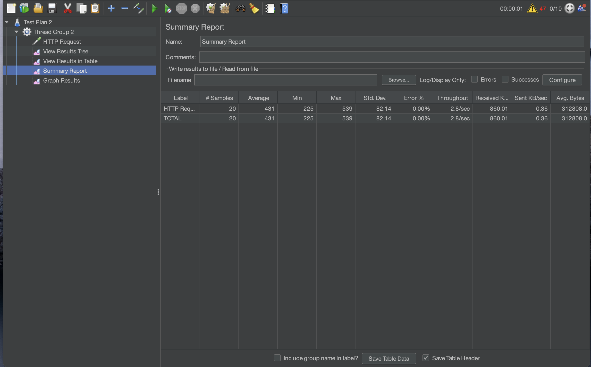

# Module 5 - Profiling

### First Time Performance Testing via GUI

#### 1. Test for /all-student


#### 2. Test for /all-student-name




#### 3. Test for /highest-gpa


### First Time Performance Testing via Command Line

#### 1. Test for /all-student


#### 2. Test for /all-student-name


#### 3. Test for /highest-gpa


## Reflection
1. What is the difference between the approach of performance testing with JMeter and profiling with IntelliJ Profiler in the context of optimizing application performance?
Pengujian performa dengan JMeter berfokus pada peforma oleh pengguna dan mengukur respons time, throughput, serta kestabilan sistem. JMeter digunakan untuk mengevaluasi kinerja aplikasi secara keseluruhan dalam kondisi nyata.
Sementara itu, profiling dengan IntelliJ Profiler lebih berfokus pada analisis mendalam di dalam kode aplikasi. Profiling membantu mengidentifikasi bottleneck di CPU, memori, dan alur eksekusi kode

2. How does the profiling process help you in identifying and understanding the weak points in your application?
- Dengan melihat query yang labar dalam call tree dan durasi eksekusi.
- Dengan melihat apakah terdapat memory leaks pada heap dump
- Dengan melihat penggunaan CPU dan garbage collection

3. Do you think IntelliJ Profiler is effective in assisting you to analyze and identify bottlenecks in your application code?
Ya karena profiler Intellij memberikan visualisasi call tree yang membantu kita dalam memahami jalur eksekusi kode. Adapun fitur lain seperti real-time profiling untuk melihat efek perubahan secara langsung. Analisis Heap Dump untuk deteksi kebocoran memori dan lain lain.

4. What are the main challenges you face when conducting performance testing and profiling, and how do you overcome these challenges?
Salah satu tantangan terbesar dalam profiling adalah menarik kesimpulan dari hasil analisis. Misalnya, saat mengoptimasi pencarian highest GPA, hasil pengujian awal menunjukkan eksekusi sekitar 40ms, yang sebenarnya sudah cukup cepat. Namun, menentukan apakah masih ada potensi optimasi membutuhkan pemahaman yang lebih mendalam tentang alur kode. Kesulitan utama dalam proses ini meliputi menentukan apakah optimasi benar-benar diperlukan, menganalisis call tree dan profiling data untuk memahami metode mana yang paling banyak menghabiskan waktu, serta menyeimbangkan antara optimasi dan keterbacaan kode agar tetap mudah dikelola.
Untuk mengatasi tantangan ini, langkah pertama yang perlu dilakukan adalah memulai analisis dari call tree guna mengidentifikasi metode yang menghabiskan paling banyak waktu dan menjadikannya sebagai titik awal optimasi. Selain itu, pendekatan berbasis data harus diutamakan agar keputusan optimasi didukung oleh metrik dari profiler, bukan hanya berdasarkan perkiraan semata. Setelah melakukan optimasi, penting untuk membandingkan hasil sebelum dan sesudah perubahan guna memastikan bahwa optimasi yang dilakukan benar-benar memberikan peningkatan signifikan. Terakhir, optimasi harus difokuskan pada bottleneck yang paling berpengaruh terhadap performa keseluruhan, sehingga tidak membuang waktu pada bagian kode yang tidak memiliki dampak besar terhadap kinerja aplikasi.

5. What are the main benefits you gain from using IntelliJ Profiler for profiling your application code?
- Membantu memahami performa kode secara mendalam (CPU, memori, thread).
- Membantu menemukan metode yang tidak efisien yang menyebabkan bottleneck.
- Mempermudah analisis memory leak dengan heap dump analysis.
- Bisa digunakan secara real-time saat debugging untuk melihat dampak perubahan kode secara langsung.

6. How do you handle situations where the results from profiling with IntelliJ Profiler are not entirely consistent with findings from performance testing using JMeter?
- Bandingkan lingkungan pengujian – Pastikan beban pengguna, jumlah request, dan konfigurasi sistem sama.
- Analisis thread dump dan garbage collection – Bisa jadi ada thread contention atau pause yang mempengaruhi hasil profiling.
- Jalankan profiling di bawah beban nyata – Gunakan profiling di lingkungan staging dengan JMeter berjalan agar hasil lebih mendekati kondisi produksi.

7. What strategies do you implement in optimizing application code after analyzing results from performance testing and profiling? How do you ensure the changes you make do not affect the application's functionality?
1. **Optimasi `getAllStudentsWithCourses()`**

   Sebelumnya, metode ini mengambil daftar mahasiswa terlebih dahulu, kemudian melakukan query tambahan untuk mengambil data mata kuliah yang diikuti oleh setiap mahasiswa. Hal ini menyebabkan banyak query dieksekusi yang berpotensi memperlambat performa. Oleh karena itu, pendekatan yang lebih efisien diterapkan dengan menggunakan **fetch join** langsung di query repository:

   ```java
   @Query("SELECT sc FROM StudentCourse sc JOIN FETCH sc.student JOIN FETCH sc.course")
   List<StudentCourse> findAllWithStudentsAndCourses();
   ```

   Dengan cara ini, data mahasiswa dan kursus dapat diambil dalam satu kali query, mengurangi jumlah pemanggilan ke database dan meningkatkan performa pengambilan data.

2. **Optimasi `joinStudentNames()`**

   Sebelumnya, metode ini menggunakan perulangan manual untuk menggabungkan nama mahasiswa dalam satu string, yang kurang efisien dan berpotensi menyebabkan masalah kinerja jika jumlah data besar. Untuk meningkatkan efisiensi, digunakan pendekatan berbasis **Java Stream API**:

   ```java
   return studentRepository.findAll().stream()
           .map(Student::getName)
           .collect(Collectors.joining(", "));
   ```

   Dengan pendekatan ini, kode menjadi lebih ringkas, lebih mudah dibaca, serta memanfaatkan optimasi internal dari Java Stream untuk mengolah data lebih efisien.

3. **Optimasi `findStudentWithHighestGpa()`**

   Sebelumnya, metode ini mengambil seluruh daftar mahasiswa dari database, lalu mencari mahasiswa dengan GPA tertinggi menggunakan perulangan di dalam aplikasi. Cara ini tidak efisien karena semua data dimuat ke memori sebelum diproses. Solusi yang diterapkan adalah dengan mengubah query langsung di repository agar seleksi dilakukan di tingkat database:

   ```java
   @Query("SELECT s FROM Student s ORDER BY s.gpa DESC LIMIT 1")
   Optional<Student> findStudentWithHighestGpa();
   ```

   Kemudian, metode service cukup memanggil repository ini:

   ```java
   public Optional<Student> findStudentWithHighestGpa() {
       return studentRepository.findStudentWithHighestGpa();
   }
   ```
    Adapun hasil dari test setelah ini semua diimplementasikan sebagai berikut:


